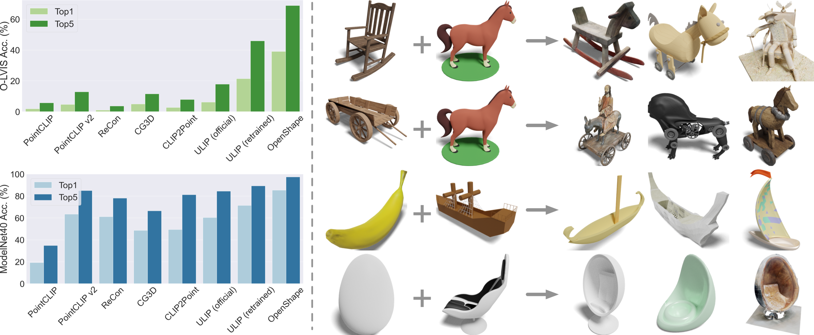

# OpenShape: Scaling Up 3D Shape Representation Towards Open-World Understanding
 [\[project\]](https://colin97.github.io/OpenShape/) [\[paper\]](https://arxiv.org/pdf/2305.10764.pdf)  [\[Live Demo\]](https://huggingface.co/spaces/OpenShape/openshape-demo) 

[***News***] OpenShape is accepted by NeurIPS 2023. See you in New Orleans!

[***News***] We have released our checkpoints, training code, and training data!

[***News***] [Live demo](https://huggingface.co/spaces/OpenShape/openshape-demo) released! Thanks HuggingFace🤗 for sponsoring this demo!!

Official code of "OpenShape: Scaling Up 3D Shape Representation Towards Open-World Understanding".


Left: Zero-shot 3D shape classification on the Objaverse-LVIS (1,156 categories) and ModelNet40 datasets (40 common categories). Right: Our shape representations encode a broad range of semantic and visual concepts. We input two 3D shapes and use their shape embeddings to retrieve the top three shapes whose embeddings are simultaneously closest to both inputs.


## Online Demo

Explore the online [demo](https://huggingface.co/spaces/OpenShape/openshape-demo), which currently supports: (a) 3D shape classification (LVIS categories and user-uploaded texts), (b) 3D shape retrieval (from text, image, and 3D point cloud), (c) point cloud captioning, and (d) point cloud-based image generation.

The demo is built with [streamlit](https://streamlit.io). If you encounter "connection error", please try to clear your browser cache or use the incognito model.

The code for the demo can be found [here](https://huggingface.co/OpenShape/openshape-demo-support) and [here](https://huggingface.co/spaces/OpenShape/openshape-demo/tree/main). The support library ([README](https://huggingface.co/OpenShape/openshape-demo-support)) also serves as an inference library for models with PointBERT backbone.

## Checkpoints

| Model              | Training Data | CLIP version| Backbone | Objaverse-LVIS Zero-Shot Top1 (Top5) | ModelNet40 Zero-Shot Top1 (Top5) | gravity-axis | Notes |
| :------:  | :------: | :------: |:------: |:------: | :------: |:------: |:------: |
|[pointbert-vitg14-rgb](https://huggingface.co/OpenShape/openshape-pointbert-vitg14-rgb/tree/main)| Four datasets | OpenCLIP ViT-bigG-14 | PointBERT | 46.8 (77.0) | 84.4 (98.0) |z-axis|
|[pointbert-no-lvis](https://huggingface.co/OpenShape/openshape-pointbert-no-lvis/tree/main)| Four datasets (no LVIS) | OpenCLIP ViT-bigG-14 | PointBERT | 39.1 (68.9) | 85.3 (97.4) |z-axis|
|[pointbert-shapenet-only](https://huggingface.co/OpenShape/openshape-pointbert-shapenet/tree/main)| ShapeNet only | OpenCLIP ViT-bigG-14 | PointBERT | 10.8 (25.0) | 70.3 (91.3) |z-axis|
|[spconv-all](https://huggingface.co/OpenShape/openshape-spconv-all/tree/main)| Four datasets | OpenCLIP ViT-bigG-14 | SparseConv | 42.7 (72.8)| 83.7 (98.4)|z-axis|
|[spconv-all-no-lvis](https://huggingface.co/OpenShape/openshape-all-no-lvis/tree/main)| Four datasets (no LVIS) | OpenCLIP ViT-bigG-14 | SparseConv | 38.1 (68.2)|84.0 (97.3)|z-axis|
|[spconv-shapenet-only](https://huggingface.co/OpenShape/openshape-spconv-shapenet-only/tree/main)| ShapeNet only | OpenCLIP ViT-bigG-14 | SparseConv | 12.1 (27.1) |74.1 (89.5)|z-axis|
|[pointbert-vitl14-rgb](https://huggingface.co/OpenShape/openshape-pointbert-vitl14-rgb/tree/main)| Objaverse (No LVIS) | CLIP ViT-L/14 | PointBERT |N/A | N/A|y-axis|used for image generation demo
|[pointbert-vitb32-rgb](https://huggingface.co/OpenShape/openshape-pointbert-vitb32-rgb/tree/main)| Objaverse | CLIP ViT-B/32 | PointBERT |N/A | N/A|y-axis|used for pc captioning demo

## Installation

If you would to run the inference or (and) training locally, you may need to install the dependendices.

1. Create a conda environment and install [pytorch](https://pytorch.org/get-started/previous-versions/), [MinkowskiEngine](https://nvidia.github.io/MinkowskiEngine/quick_start.html), and [DGL](https://www.dgl.ai/pages/start.html) by the following commands or their official guides:
```
conda create -n OpenShape python=3.9
conda activate OpenShape
conda install pytorch==1.12.1 torchvision==0.13.1 torchaudio==0.12.1 cudatoolkit=11.3 -c pytorch
pip install -U git+https://github.com/NVIDIA/MinkowskiEngine
conda install -c dglteam/label/cu113 dgl
```
2. Install the following packages:
```
pip install huggingface_hub wandb omegaconf torch_redstone einops tqdm open3d 
```

## Inference

Try the following example code for computing OpenShape embeddings of 3D point clouds and computing 3D-text and 3D-image similarities.
```
python3 src/example.py
```
Please normalize the input point cloud and ensure the gravity axis of the point cloud is aligned with the pre-trained models.

## Training

1. The processed training and evaluation data can be found [here](https://huggingface.co/datasets/OpenShape/openshape-training-data). Download and uncompress the data by the following command:
```
python3 download_data.py
```
The total data size is ~205G and files will be downloaded and uncompressed in parallel. If you don't need training and evaluation on the Objaverse dataset, you can skip that part (~185G). 

2. Run the training by the following command:
```
wandb login {YOUR_WANDB_ID}
python3 src/main.py dataset.train_batch_size=20 --trial_name bs_20
```
The default config can be found in `src/configs/train.yml`, which is trained on a single A100 GPU. You can also change the setting by passing the arguments. Here are some examples for main experiments used in the paper:

```
python3 src/main.py --trial_name spconv_all
python3 src/main.py --trial_name spconv_no_lvis dataset.train_split=meta_data/split/train_no_lvis.json 
python3 src/main.py --trial_name spconv_shapenet_only dataset.train_split=meta_data/split/ablation/train_shapenet_only.json 
python3 src/main.py --trial_name pointbert_all model.name=PointBERT model.scaling=4 model.use_dense=True training.lr=0.0005 training.lr_decay_rate=0.967 
python3 src/main.py --trial_name pointbert_no_lvis model.name=PointBERT model.scaling=4 model.use_dense=True training.lr=0.0005 training.lr_decay_rate=0.967 dataset.train_split=meta_data/split/train_no_lvis.json 
python3 src/main.py --trial_name pointbert_shapenet_only model.name=PointBERT model.scaling=4 model.use_dense=True training.lr=0.0005 training.lr_decay_rate=0.967 dataset.train_split=meta_data/split/ablation/train_shapenet_only.json 
```
You can track the training and evaluation (Objaverse-LVIS and ModelNet40) curves on your wandb page.

## Data 
All data can be found [here](https://huggingface.co/datasets/OpenShape/openshape-training-data). Use `python3 download_data.py` for downloading them.

### Training Data
Training data consists of `Objaverse/000-xxx.tar.gz`, `ShapeNet.tar.gz`, `3D-FUTURE.tar.gz`, and `ABO.tar.gz`. After uncompression, you will get a numpy file for each shape, which includes:
- `dataset`: str, dataset of the shape.
- `group`: str, group of the shape.
- `id`: str, id of the shape.
- `xyz`: numpy array (10000 x 3, [-1,1]), point cloud of the shape.
- `rgb`: numpy array (10000 x 3, [0, 1]), color of the point cloud.
- `image_feat`: numpy array, image features of 12 rendered images. 
- `thumbnail_feat`: numpy array, image feature for the thumbnail image. 
- `text`: list of string, original texts of the shape, constructed using the metadata of the dataset.
- `text_feat`: list of dict, text features of the `text`. "original" indicates the text features without the prompt engineering. "prompt_avg" indicates the averaged text features with the [template-based prompt enegineering](https://github.com/salesforce/ULIP/blob/main/data/templates.json). 
- `blip_caption`: str, BLIP caption generated for the thumbnail or rendered images. 
- `blip_caption_feat`: dict, text feature of the `blip_caption`.
- `msft_caption`: str, Microsoft Azure caption generated for the thumbnail or rendered images.
- `msft_caption_feat`: dict, text feature of the `msft_caption`.
- `retrieval_text`: list of str, retrieved texts for the thumbnail or rendered images.
- `retrieval_text_feat`: list of dict, text features of the `retrieval_text`. 

All image and text features are extracted using OpenCLIP (ViT-bigG-14, laion2b_s39b_b160k).

### Meta Data
`meta_data.zip` includes the meta data used for training and evaluation (on Objaverse-LVIS, ModelNet40, and ScanObjectNN):
- `split/`: list of training shapes. `train_all.json` indicates training with four datasets (Objaverse, ShapeNet, ABO, and 3D-FUTURE). `train_no_lvis.json` indicates training with four datasets but Objaverse-LVIS shapes excluded. `ablation/train_shapenet_only.json` indeicates training with ShapeNet shapes only.
- `gpt4_filtering.json`: filtering results of Objaverse raw texts, generated with GPT4.
- `point_feat_knn.npy`: KNN indices calculated using shape features, used for hard mining during training.
- `modelnet40/test_split.json`: list of ModelNet40 test shapes.
- `modelnet40/test_pc.npy`: point clouds of ModelNet40 test shapes, 10000 x 3.
- `modelnet40/cat_name_pt_feat.npy`: text features of ModelNet40 category names, prompt engineering used.
- `lvis_cat_name_pt_feat.npy`: text features of Objeverse-LVIS category names, prompt engineering used.
- `scanobjectnn/xyz_label.npy`: point clouds and labels of ScanObjectNN test shapes.
- `scanobjectnn/cat_name_pt_feat.npy`:text features of ScanObjectNN category names, prompt engineering used.
All text features are extracted using OpenCLIP (ViT-bigG-14, laion2b_s39b_b160k).

## Citation

If you find our code helpful, please cite our paper:

```
@misc{liu2023openshape,
      title={OpenShape: Scaling Up 3D Shape Representation Towards Open-World Understanding}, 
      author={Minghua Liu and Ruoxi Shi and Kaiming Kuang and Yinhao Zhu and Xuanlin Li and Shizhong Han and Hong Cai and Fatih Porikli and Hao Su},
      year={2023},
      eprint={2305.10764},
      archivePrefix={arXiv},
      primaryClass={cs.CV}
}
```
